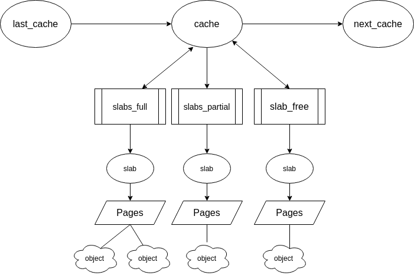

## tl;dr

+ Get an insight into the workings of the different alloctors implemented in the linux kernel.
+ Venture a little into the source code.

## The Slob Allocator

Simple List of Blocks allocator is one of the three main allocators in the linux kernel. It is mostly used in embedded systems where memory is expensive. It works using the **first fit** algorithm and hence leads to fragmentation.

## The Slab Allocator

It fixes the shortcomings of the slob allocator

The basic idea behind the slab allocator is to have caches of commonly used objects kept in an initialized state ready for use by the kernel. So why this object based allocation one may ask?

Without an object based allocator , the kernel will spend more time in allocation , initializing and freeing the same object.
{: .notice}

The slab allocator consists of a variable number of caches that are linked together on a circular doubly linked list called **cache chain**. Each cache maintains blocks of contiguous pages in memory called **slabs**.



## Principles of Slab allocator

+ The allocation of small blocks of memory to help eliminate internal fragmentation.
+ Caching of commonly used objects so that the kernel doesnt waste time.
+ Better utilization of hardware cache by aligning objects to the L1 or L2 caches.

In a general sense , the slab allocator in sits on top of a bump allocator called **buddy allocator** and makes sure that commonly used objects are cached.

The slab allocator provides Dedicated and generic cache classes. The separation between cache classes can be seen in a proc file called **/proc/slabinfo**.

### Interfaces of kernel memory allocation

**kmalloc** is the general interface the kernel provides to do generic allocations through slab allocator. There are also others like **kzalloc** (similar to glibc calloc) and krealloc.


## How does a heap chunk look like in the kernel?

With the slab allocator , kmalloc'd chunks **dont have any metadata** like headers for size in glibc. The free chunks obviously are stored in a single linked list.

+ A slab allocator interface like kmalloc searches the right **kmem\_cache structure** that serves a given size of allocation.


## A little exploration of the source code

For sizes less than or equal to **192**, kmalloc maintains immediate caches of sizes of range 8 to 192.

```c
static __always_inline void *__do_kmalloc(size_t size, gfp_t flags,
					  unsigned long caller)
{
	struct kmem_cache *cachep;
	void *ret;

	if (unlikely(size > KMALLOC_MAX_CACHE_SIZE))
		return NULL;
	cachep = kmalloc_slab(size, flags);
	if (unlikely(ZERO_OR_NULL_PTR(cachep)))
		return cachep;
	ret = slab_alloc(cachep, flags, caller);

	ret = kasan_kmalloc(cachep, ret, size, flags);
	trace_kmalloc(caller, ret,
		      size, cachep->size, flags);

	return ret;
}
```

The call to kmalloc_slab is demonstrated.

```c
struct kmem_cache *kmalloc_slab(size_t size, gfp_t flags)
{
	unsigned int index;

	if (size <= 192) {
		if (!size)
			return ZERO_SIZE_PTR;

		index = size_index[size_index_elem(size)];
	} else {
		if (WARN_ON_ONCE(size > KMALLOC_MAX_CACHE_SIZE))
			return NULL;
		index = fls(size - 1);
	}

	return kmalloc_caches[kmalloc_type(flags)][index];
}
```
+ If requested size is greater than **KMALLOC\_MAX\_CACHE\_SIZE** which is the size of two pages **8192** , then a call to **kmalloc\_large** is made.
+ The call to **kmalloc\_slab** gets a cache pool using size based indexing.

The **slub\_alloc** calls another function **slab\_alloc\_node**.
```c
static __always_inline void *slab_alloc(struct kmem_cache *s,
		gfp_t gfpflags, unsigned long addr)
{
	return slab_alloc_node(s, gfpflags, NUMA_NO_NODE, addr);
}

```

Here, the variable **NUMA\_NO\_NODE** that is **Non uniform memory access** cells. 

From a hardware aspect, a NUMA system can be assumed to be cells of memory each of which is in itself a symmetric memory processor subset of the system. They provide a scalable memory bandwidth.
{: .notice}

```c
static __always_inline void *slab_alloc_node(struct kmem_cache *s,
		gfp_t gfpflags, int node, unsigned long addr)
{
	void *object;
	struct kmem_cache_cpu *c;
	struct page *page;
	unsigned long tid;
	struct obj_cgroup *objcg = NULL;

	s = slab_pre_alloc_hook(s, &objcg, 1, gfpflags);
    if(!s)
        return NULL;
    ...
    ...
```

Let us dive into the **slab\_pre\_alloc\_hook**.

```c
static inline struct kmem_cache *slab_pre_alloc_hook(struct kmem_cache *s,
						     gfp_t flags)
{
	flags &= gfp_allowed_mask;
	lockdep_trace_alloc(flags);
	might_sleep_if(gfpflags_allow_blocking(flags));

	if (should_failslab(s->object_size, flags, s->flags))
		return NULL;

	return memcg_kmem_get_cache(s, flags);
}
```
Masking of bits is done to ensure that the relevant operation is dont. The more interesting part is the **might\_sleep\_if** function which actually returns a boolean value to decide whether the given flag can cause a sleep or not.

```c
static inline bool gfpflags_allow_blocking(const gfp_t gfp_flags)
{
	return (bool __force)(gfp_flags & __GFP_DIRECT_RECLAIM);
}
```

The **GFP\_KERNEL** flag is actually flag obtained by or'ing 3 lower level flags.


```c
#define __GFP_DIRECT_RECLAIM	((__force gfp_t)___GFP_DIRECT_RECLAIM) /* Caller can reclaim */
#define __GFP_RECLAIM ((__force gfp_t)(___GFP_DIRECT_RECLAIM|___GFP_KSWAPD_RECLAIM))
#define GFP_KERNEL	(__GFP_RECLAIM | __GFP_IO | __GFP_FS)
```

This means, our **gfpflags\_allow\_blocking** will return a true with **GFP\_KERNEL**. This makes sense as getting a free slab may require time and if we sleep , we can give our processor to switch to another task in the meanwhile.

Ok so back to **slab\_alloc\_node**, the next section is - 

```c
redo:
	/*
	 * Must read kmem_cache cpu data via this cpu ptr. Preemption is
	 * enabled. We may switch back and forth between cpus while
	 * reading from one cpu area. That does not matter as long
	 * as we end up on the original cpu again when doing the cmpxchg.
	 *
	 * We should guarantee that tid and kmem_cache are retrieved on
	 * the same cpu. It could be different if CONFIG_PREEMPT so we need
	 * to check if it is matched or not.
	 */
	do {
		tid = this_cpu_read(s->cpu_slab->tid);
		c = raw_cpu_ptr(s->cpu_slab);
	} while (IS_ENABLED(CONFIG_PREEMPT) &&
		 unlikely(tid != READ_ONCE(c->tid)));

```

**tid** is a unique cpu transaction id.

```c
#define TID_STEP  roundup_pow_of_two(CONFIG_NR_CPUS)

```

Each CPU has tid initialised to the CPU number and is incremented by the **CONFIG\_NR\_CPUS** and thus are kept unique.

+ The next while loop is simply for checking if another thread of CPU is trying to call **slab\_alloc\_node** and if so , its tid will be different and hence the tid is re-read.

```c
	barrier();

	/*
	 * The transaction ids are globally unique per cpu and per operation on
	 * a per cpu queue. Thus they can be guarantee that the cmpxchg_double
	 * occurs on the right processor and that there was no operation on the
	 * linked list in between.
	 */

	object = c->freelist;
	page = c->page;
	if (unlikely(!object || !page || !node_match(page, node))) {
		object = __slab_alloc(s, gfpflags, node, addr, c);
	} else {
		void *next_object = get_freepointer_safe(s, object);

		/*
		 * The cmpxchg will only match if there was no additional
		 * operation and if we are on the right processor.
		 *
		 * The cmpxchg does the following atomically (without lock
		 * semantics!)
		 * 1. Relocate first pointer to the current per cpu area.
		 * 2. Verify that tid and freelist have not been changed
		 * 3. If they were not changed replace tid and freelist
		 *
		 * Since this is without lock semantics the protection is only
		 * against code executing on this cpu *not* from access by
		 * other cpus.
		 */
		if (unlikely(!this_cpu_cmpxchg_double(
				s->cpu_slab->freelist, s->cpu_slab->tid,
				object, tid,
				next_object, next_tid(tid)))) {

			note_cmpxchg_failure("slab_alloc", s, tid);
			goto redo;
		}
		prefetch_freepointer(s, next_object);
		stat(s, ALLOC_FASTPATH);
	}
```

The **barrier** simply ensures that read occurs in order.
+ The first free object is read into the **object** variable and if the page has no objects left , a call to slab alloc is done to do an entire new allocation from here.

+ If we have free objects , a call to **get\_freepointer\_safe()** is made to get the free object.

+ Following this , a call to **cmpxchg** is made which is to check if the freelist pointer and the tid have not been changed , and if not , they are respectively updated with their new values of **next\_object** and **next\_tid**.

+ The **cmpxchg** happens atomically and hence there is no need of locking here.

+ Moving on , we have a call to **prefetch\_freepointer** which just adds our object with the offset and basically sets up the next free chunk in the list to the cache line.
+ Finally , **slab\_post\_alloc\_hook** is called which returns the modified slab to the memory control group.


In short , the entire process of allocating memory using slab allocator is - 

+ Suppose kernel is asked for a size of x.

+ Slab allocator looks in the slab index for the slab that holds object of size x.

+ The slab allocator gets a pointer to slab where objects are stored.

+ Finds the first empty slot

+ Similar process is used for freeing the allocated slab.


So why'd we move from slab allocator , and now linux uses the SLUB allocator? 

You see , slab had its own scalability problems. Slab object queues exist per node per CPU. For very large systems, such queues may grow exponentially and hence at some point of processing , may consume the entire system memory which is not what we need.


Hence , the need of a more scalable allocator was the need of the hour.

## The SLUB Allocator

It keeps the same inner principles of the SLAB allocator but drops the requirements of the complex queues and per slab metadata. Information about all the active slabs is kept in the **kmem\_cache** structure. Per-slab metadata is kept  in three basic fields 

```
void *freelist;
short unsigned int inuse;
short unsigned int offset;

```

+ Freelist is the pointer to the first free chunk in the slab.

+ inuse is the count of number of objects being used.

+ offset is offset to the next free chunk.


SLUB also introduces the coalescing of slabs which greatly reduces the memory overhead.

## Conclusion

The implementation of kmalloc is a very interesting process of linux kernel memory management. The techniques employed to implement kmalloc are quite fascinating and thought provoking. 

Here are the references to everything covered in this post :

+ [Source Code](https://elixir.bootlin.com/linux/latest/source/mm/slab.c#L3664)
+ [An awesome post on kmalloc internals](https://ruffell.nz/programming/writeups/2019/02/15/looking-at-kmalloc-and-the-slub-memory-allocator.html)
+ [A little on NUMA](https://www.kernel.org/doc/html/latest/vm/numa.html)

